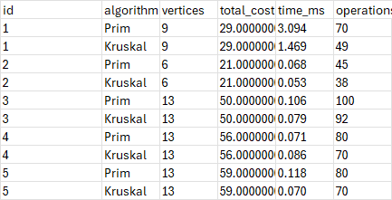
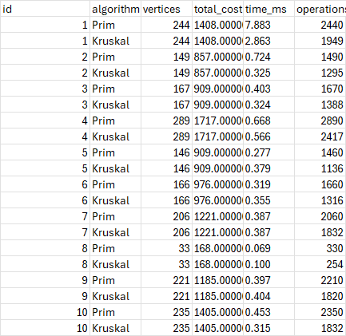
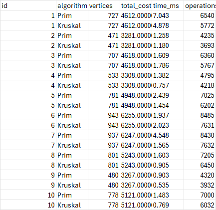
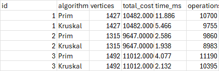
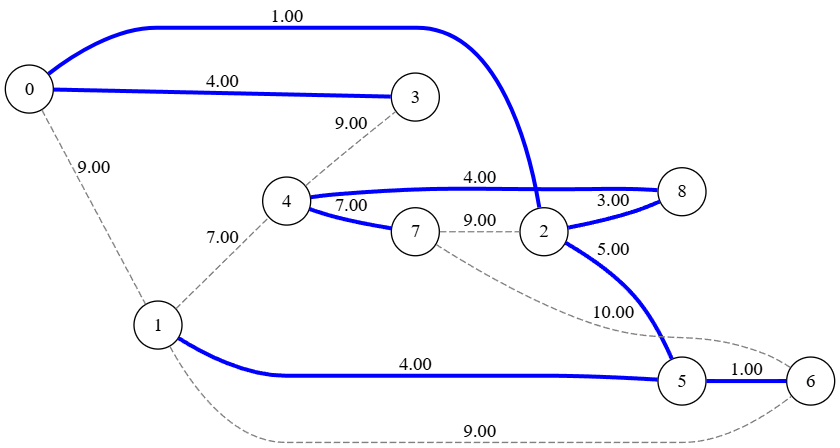
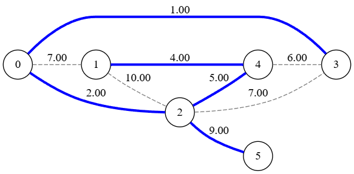
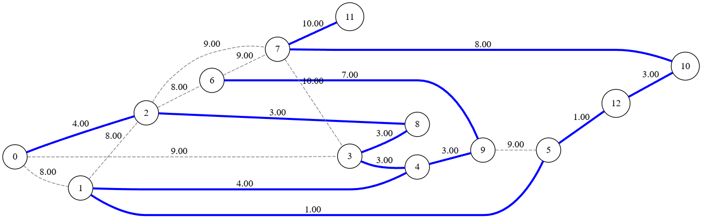
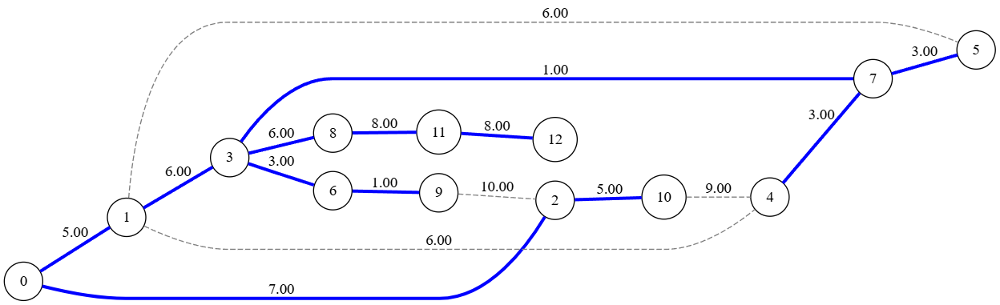
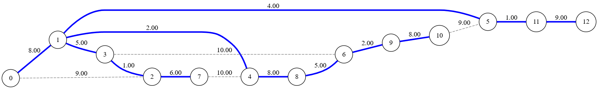

# Assignment 3 — Minimum Spanning Tree (Prim + Kruskal)
Student: Aikyn Sagyntai <br>
Group: SE-2429 <br>
Course: Design and Analysis of Algorithms

This project implements **Prim's** and **Kruskal's** algorithms in Java for finding the **Minimum Spanning Tree (MST)**.  
It includes JSON/CSV metric export, JUnit tests, and Graphviz visualization.

---

## Project Structure

```text
├── algo/ # Prim.java, Kruskal.java
├── io/ # JsonReader.java
├── metrics/ # Metrics.java, AlgorithmRecorder.java, OpCounter.java, StopWatch.java
├── model/ # Graph.java, Edge.java
├── mst/ # MstResult.java, GraphChecks.java, MstCoreResult.java, MstAlgorithm
├── util/ # DonOut.java, JsonOut.java
├── graphDots/ # Generated DOT and PNG visualization files
├── data/ # CSV File which have all results
├── images/ # All images
└── json/ # All json files
```
---


## Testing

JUnit automatically verifies:
- Cost equality - Prim and Kruskal return identical total cost
- Tree size - ```E_MST = V - 1```
- Acyclicity - MST contains no cycles 
- Connectivity - MST connects all vertices 
- Disconnected graph - Properly sets ```connected=false``` 
- Time and operations - Positive, recorded, reproducible


## Output Format
JSON Output Example (data/output.json)
```js
[ {
"graphId" : "1",
"algorithm" : "Prim",
"vertices" : 7,
"edgesInMst" : 4,
"totalCost" : 10.0,
"timeMs" : 0.0261,
"operations" : 20,
"acyclic" : true,
"connected" : false,
"mstEdges" : [ [ 0, 1 ], [ 1, 2 ], [ 2, 3 ], [ 4, 5 ] ]
}, {
"graphId" : "1",
"algorithm" : "Kruskal",
"vertices" : 7,
"edgesInMst" : 4,
"totalCost" : 10.0,
"timeMs" : 0.0497,
"operations" : 20,
"acyclic" : true,
"connected" : false,
"mstEdges" : [ [ 4, 5 ], [ 1, 2 ], [ 0, 1 ], [ 2, 3 ] ]
}
]
```

## CSV Output Example (data/mst_metrics.csv)
#### Small Graphs <br>
<br>
#### Medium Graphs <br>
<br>
#### Large Graphs <br>
<br>
#### Extra Large Graphs <br>


Observation:
Both algorithms produce the same MST cost and structure.
Kruskal is faster for small/sparse graphs;
Prim performs similarly for larger or denser ones.


## Comparison — Theory vs Practice
| Aspect               | Prim                      | Kruskal                      |
| -------------------- | ------------------------- | ---------------------------- |
| Approach             | Grows from one vertex     | Adds smallest edges globally |
| Data Structure       | Min-heap / Priority Queue | Union–Find                   |
| Complexity           | `O(E log V)`              | `O(E log E)`                 |
| Best For             | Dense graphs              | Sparse graphs                |
| Graph Representation | Adjacency list/matrix     | Edge list                    |
| Implementation       | Simpler                   | Slightly more complex        |

Practice Results:
- Both algorithms identical in total cost.
- Kruskal executes faster on small graphs (less heap usage).
- Prim scales slightly better on dense graphs.
- Both show O(E log V) growth consistent with theory. 

## Performance Comparison Charts


**Interpretation:**  
Kruskal shows faster execution for sparse graphs due to efficient edge sorting,  
while Prim performs comparably for denser graphs where adjacency lookups dominate.


### Conclusions
#### Correctness:
- Both algorithms produce identical MST weights and edges (different order possible).

#### Performance:
- Kruskal generally runs faster for sparse graphs because sorting edges once is cheaper than frequent heap operations.

#### Scalability:
- Prim is more efficient for dense graphs with adjacency lists.

#### Preference:
- Sparse graphs → Kruskal
-Dense graphs → Prim

#### Complexity trade-off:
- Kruskal is more elegant in theory but Prim integrates easier in codebases that already use adjacency lists.

## Visualization

You can generate DOT graph files and PNG visualizations using https://dreampuf.github.io/GraphvizOnline/.

We have ```.dot``` files, and when we upload it to the website, we will get the result.
I have implemented only generation in the ```.dot``` files. <br>
For example: Small Graphs images <br>
 <br>
 <br>
 <br>
 <br>
 <br>

## Bonus Section (Graph Design)

Custom Graph and Edge classes are used to:
- Store adjacency list structure, 
- Integrate directly with MST algorithms, 
- Support visualization through Graphviz.

Generated ```dot``` files in graphDots/ show graph loading and MST integration, satisfying the bonus requirement.

## References

- Robert Sedgewick, Kevin Wayne. Algorithms, 4th Edition. Princeton University Press, 2011. → https://algs4.cs.princeton.edu/home/
- algs4.jar — Princeton University library for data structures and graph algorithms. → https://algs4.cs.princeton.edu/code/

- Jackson Core / Databind Library (FasterXML) — used for JSON serialization and parsing in this project.
→ https://github.com/FasterXML/jackson and → https://mvnrepository.com/artifact/com.fasterxml.jackson.core/jackson-databind

- Graphviz — Open-source tool for visualizing graph data structures.
→ https://graphviz.org

- Astana IT University — Design and Analysis of Algorithms Course Materials.
→ https://astanait.edu.kz
- ChatGPT - Generating ```.json``` files automated → https://chatgpt.com